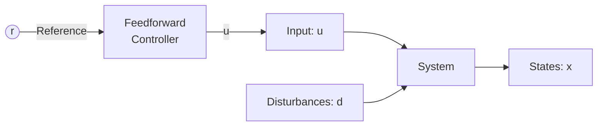
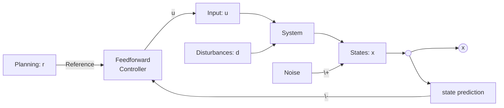

# Lecture 1

## Video1. 为什么要学习控制

1. 卫星导航系统

> Dead Recking: 

> 死算（Dead reckoning）是一种导航技术，用于估算当前位置和未来位置，而无需依赖外部参考点，如GPS或星图。它通过使用已知的出发点、航行方向、速度和时间来计算位置。这种方法在早期海洋和航空导航中非常常用，尤其是在无法获得其他导航信号时。

> 具体来说，死算涉及以下步骤：

> 出发点：从一个已知的位置开始。
> 
> 方向：使用罗盘或其他仪器确定航行的方向。
> 
> 速度：测量移动的速度，例如通过计程仪或速度表。
> 
> 时间：记录所花费的时间以计算距离。

## 2. 以汽车操控举例控制 

1. Feedforward: 不需要知道输出状态
   - Feedforward的缺陷：光知道reference无法对环境error做出纠正。

2. 于是提出Feedback: close loop

Feedback危险： 改变 dynamic of the system。因为controller changing system as the fun of the current state.

3. Feedback 家族：囊括全部control 方法

4. Plan

5. Measure: cause noise

6. State estimation: what measurements can really predict the state.
